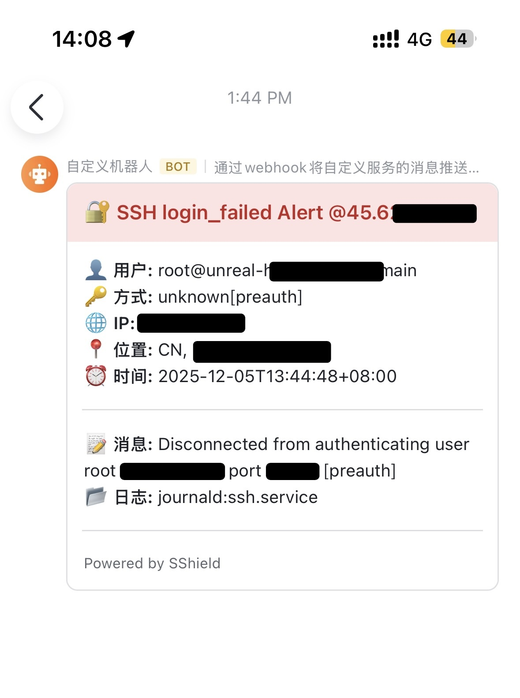

<div align="center">
    <h1>SSHield</h1>
    <p>
        Linux 服务器SSH加固工具
    </p>
</div>

> [!caution]
> Linux 发行版兼容性尚未完全覆盖，生产环境请先测试验证

## 特性

- 🔐 SSH 安全加固
  - 密钥登录配置
  - 密码安全策略
  - 自定义端口

- 📧 ssh登录事件通知
  - 基于 journalctl 的实时监听（systemd）
  - 支持 curl 与 SMTP 邮件通知
  - 支持 cron/systemd timer 的一次性扫尾模式

## 安装

### 一键安装（推荐）

```bash
# 需要 root 权限执行, 安装到/usr/local/bin/
curl -Lo /usr/local/bin/sshield https://github.com/Hootrix/sshield/releases/latest/download/sshield-linux-$(uname -m | sed 's/x86_64/amd64/;s/aarch64/arm64/') && chmod +x /usr/local/bin/sshield
```

### 手动下载

从 [Releases](https://github.com/Hootrix/sshield/releases) 下载对应架构的二进制文件：
- `sshield-linux-amd64` - x86_64 架构
- `sshield-linux-arm64` - ARM64 架构

### 从源码编译

```bash
go install github.com/Hootrix/sshield/cmd/sshield@latest
```

## 使用

```bash
# 开启调试输出（可选）
export SSHIELD_DEBUG=1


# 查看帮助
sshield --help

# SSH 加固
sshield ssh key --type ed25519           # 配置密钥登录
sshield ssh password-login --disable     # 禁用密码登录
sshield ssh change-password -u user -r   # 为用户生成随机强密码
sshield ssh port -p 2222                 # 修改 SSH 端口

# ssh 通知渠道配置
# curl webhook
sshield notify curl 'curl -X POST -H "Content-Type: application/json" -d "{\"msgtype\":\"text\",\"text\":{\"content\":\"SSH登录: {{.User}}@{{.IP}}\"}}" https://qyapi.weixin.qq.com/cgi-bin/webhook/send?key=xxx'
# 支持 --base64 传入编码字符，避免引号和空格问题
sshield notify curl --base64 'Y3VybCAtWCBQT1NUIC1IICJDb250ZW50LVR5cGU6IGFwcGxpY2F0aW9uL2pzb24iIC1kICJ7XCJ1c2VyXCI6XCJ7ey5Vc2VyfX1cIn0iIGh0dHBzOi8vZXhhbXBsZS5jb20vd2ViaG9vaw=='

# email
sshield notify email --to ops@example.com --from ssh@example.com --server smtp.example.com --user smtp-user --password secret

sshield notify test                      # 发送测试通知
sshield notify status                    # 查看当前通知渠道配置
sshield notify enable --all # 启用所有通知渠道
sshield notify enable --name my-webhook	# 按名称启用
sshield notify enable --index 1	# 按序号启用
sshield notify disable --all # 禁用所有通知渠道
# 新增/删除/修改渠道都会立即生效


# 推荐ssh监听服务(systemd service)
sudo sshield service install --notify-on success                 # 仅成功提醒，减少打扰
sudo sshield service install --notify-on all --fail-limit 3 --fail-window 1h  # 通知所有，但限制失败频率：每 IP 每小时最多 3 条

# 启动并设置服务开机自启
sudo systemctl start sshield-notify
sudo systemctl enable sshield-notify
# 查看状态
sshield service status
# 卸载ssh监听服务(systemd service)
sudo sshield service uninstall


# 开启ssh登录监听（手动）
# 仅成功提醒
sshield ssh watch --notify-on success
# 全量提醒，但每 IP 失败每小时最多 3 条
sshield ssh watch --notify-on all --fail-limit 3 --fail-window 1h


# 单次日志扫尾检查
sshield ssh sweep --since 5m             # 处理最近 5 分钟登录事件（默认仅输出）
sshield ssh sweep --since 5m --notify --notify-on success
sshield ssh sweep --since 5m --notify --notify-on all --fail-limit 3 --fail-window 1h

# 可选参数：--source auto|journal|file，--timezone Asia/Shanghai|Local 等
# 可选参数：--journal-unit sshd.service --log-path /var/log/auth.log 等
# 通知过滤：--notify-on all|success|failed
# 失败限流：--fail-limit N --fail-window 1h/1d/1w/1M 等

```

默认保存位置：
- 配置文件：`/etc/sshield/notify.json`
- 状态文件：`/var/lib/sshield/notify.state`

> **注意**：使用 `watch` 或 `sweep --notify` 前，需先配置通知方式（email 或 webhook），否则只会输出日志不会发送通知。

### notify curl 命令可可用模板变量
```
{{.Type}}      - 事件类型（login_success/login_failed）
{{.User}}      - 登录用户名
{{.IP}}        - 来源 IP
{{.Port}}      - 来源端口
{{.Method}}    - 认证方式（password/publickey）
{{.Hostname}}  - 服务器主机名
{{.Timestamp}} - 事件时间
{{.Location}}  - IP 地理位置
{{.LogPath}}   - 日志来源路径
{{.Message}}   - 原始日志消息
{{.HostIP}}    - 主机 IP
```

支持`text/template`模板语法:

```
{{if eq .Type "login_success"}}yellow{{else}}red{{end}}
```

### lark 飞书 通知样例

```
curl -X POST -H "Content-Type: application/json" -d '{"msg_type":"interactive","card":{"header":{"template":"{{if eq .Type \"login_success\"}}yellow{{else}}red{{end}}","title":{"content":"🔐 SSH {{.Type}} Alert @{{.HostIP}}","tag":"plain_text"}},"config":{"wide_screen_mode":true},"elements":[{"tag":"div","text":{"content":"**👤 用户:** {{.User}}@{{.Hostname}}\\n**🔑 方式:** {{.Method}}\\n**🌐 IP:** {{.IP}}\\n**📍 位置:** {{.Location}}\\n**⏰ 时间:** {{.Timestamp}}","tag":"lark_md"}},{"tag":"hr"},{"tag":"div","text":{"content":"**📝 消息:** {{.Message}}\\n**📂 日志:** {{.LogPath}}","tag":"lark_md"}},{"tag":"hr"},{"tag":"note","elements":[{"tag":"plain_text","content":"Powered by SSHield"}]}]}}' https://open.feishu.cn/open-apis/bot/v2/hook/XXXXXXXXX
```


## systemctl和日志

默认未配置通知渠道时，`watch`/`sweep` 仍会将监控结果输出到标准输出，可配合 systemd 日志留档。

```bash
# 开启服务
## systemd 重新加载配置
# sudo systemctl daemon-reload
## 同时启用服务的开机自启功能并立即启动该服务 
sudo systemctl enable --now sshield-notify.service

# 查看systemctl状态
sudo systemctl status sshield-notify

# 重启服务
sudo systemctl restart sshield-notify

# 查看系统journalctl日志
sudo journalctl -u sshield-notify -f

# 查看系统ssh日志
sudo journalctl -u ssh.service -n 20 --no-pager

```

### cron 兜底

即使 watch 进程意外退出，cron 也能定期补漏：

```bash
# 每分钟扫描最近 90 秒的登录事件
* * * * * /usr/local/bin/sshield ssh sweep --since 90s --notify >> /var/log/sshield.log 2>&1
```

## 开发 

### 构建

```bash
CGO_ENABLED=0 GOOS=linux GOARCH=amd64 go build -ldflags='-s -w -extldflags "-static -fpic"' -o bin/sshield cmd/sshield/main.go
```

### 发布流程

提交 tag之后，GitHub CI自动发布
```
# 1. 合并到 main
git checkout main
git merge dev.20251205
git push origin main

# 2. 打 tag 触发自动发布
git tag v0.1.0
git push origin v0.1.0
```


## 许可证

MIT License

